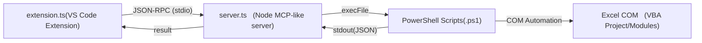

[← README に戻る](../README.md)

# 🛠 開発者向け情報 / Development (for GitHub users)
このセクションは拡張機能の利用者には不要です。拡張の開発や修正する際の作者の備忘です。
This section is unnecessary for extension users. It serves as a memo for the author when developing or modifying the extension.
https://github.com/EitaroSeta/excel-vba-sync

## 前提 / Requirements
- Windows10/11 + Microsoft Excel（VBA を実行するため）
- Windows PowerShell 5.1/v2025.2.0（PowerShell 7 は未検証）
- Node.js LTS（18 以上推奨）と npm
- Visual Studio Code（拡張の起動・デバッグに使用）

## セットアップ / Setup
```powershell
npm install
```

## ビルド & 実行 / Build & Run
```powershell
npm run compile
```
- VS Code で `F5` を押して **Extension Development Host** を起動

## 主要コマンド / Key Commands
- **Export All Modules From VBA** — Excel から VBA モジュールを一括エクスポート
- **Import Module To VBA** — 編集したモジュールを Excel に取り込み
- **Set Export Folder** — エクスポート先フォルダの指定

## パッケージ化 / Package
- **準備 / Preparation**
```powershell
npm i -g @vscode/vsce
```
- **配布 / Publish**
`vsce` で配布用 `.vsix` を作成可能（CLI）。
```powershell
npm run vscode:prepublish    ※npm run compile
vsce package                 ※extension.vsix 生成
vsce publish                 ※公開
```
`.vscodeignore` により TypeScript やテスト等はパッケージから除外されます。

## リポジトリ構成（抜粋） / Repo Layout
- `src/` — 拡張のソースコード（TypeScript）
- `scripts/` — Excel 連携用 PowerShell Script
- `locales/` — 多言語リソース（`ja.json`, `en.json`）

## アーキテクチャ変更概要
v.0.0.27の機能追加にて、VS Code (`extension.ts`) から Node.js サーバ (`server.ts`) を子プロセスとして起動し、さらに PowerShell スクリプト経由で Excel COM API を操作する流れを追加。



## ⚙️ ローカライズ設定例 / Localization Example

拡張機能の表示テキストは locales フォルダの言語別 JSON ファイルで管理しています。
現在は以下の2言語に対応していますので、*.jsonを使用したい言語に合わせて作ってください。

The extension's display text is managed in language-specific JSON files located in the locales folder.
Currently, the following two languages are supported, so please create a *.json file for the language you want to use.

 locales/
  ├─ ja.json
  └─ en.json
