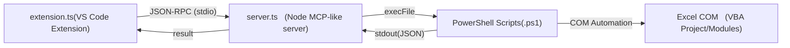

[← README に戻る](../README.md)

# 🛠 開発者向け情報 / Development (for GitHub users)
このセクションは拡張機能の利用者には不要です。拡張の開発や修正する際の作者の備忘です。
This section is unnecessary for extension users. It serves as a memo for the author when developing or modifying the extension.
https://github.com/EitaroSeta/excel-vba-sync

## 開発体制について / About the development process
v0.0.28以降の実装は、Claude（Anthropic）とのAI協働（いわゆる「vibe coding」）によって行われています。設計判断・実装・検証は都度人間が確認していますが、コードの大部分はAIエージェントが生成したものです。

Since v0.0.28, implementation has been done via AI-assisted development ("vibe coding") in collaboration with Claude (Anthropic). Design decisions, implementation, and verification are reviewed by a human at each step, but most of the code is AI-generated.

## 前提 / Requirements
- Windows10/11 + Microsoft Excel（VBA を実行するため）
- Windows PowerShell 5.1/v2025.2.0（PowerShell 7 は未検証）
- Node.js LTS（18 以上推奨）と npm
- Visual Studio Code（拡張の起動・デバッグに使用）

## セットアップ / Setup
```powershell
npm install
```

## ビルド & 実行 / Build & Run
```powershell
npm run compile
```
- VS Code で `F5` を押して **Extension Development Host** を起動

## テスト / Tests
```powershell
npm run test:unit
```
`src/server/` 配下の純粋ロジック（COM/Excel非依存の正規表現スキャン系、`dependencyScan.ts`/`referenceScan.ts`/`variableScopeScan.ts`など）に対する回帰テストです。`build:server` を先に実行してから、Node標準の `node:test` で `src/server/__tests__/*.test.js` を実行します（新規npm依存なし）。`server.ts` 自体はCOM呼び出しを伴う副作用付きモジュールのためこの対象には含まれません（実機Excelでの手動検証が必要）。

## 主要コマンド / Key Commands
- **Export All Modules From VBA** — Excel から VBA モジュールを一括エクスポート
- **Import Module To VBA** — 編集したモジュールを Excel に取り込み
- **Set Export Folder** — エクスポート先フォルダの指定

## パッケージ化 / Package
- **準備 / Preparation**
```powershell
npm i -g @vscode/vsce
```
- **配布 / Publish**
`vsce` で配布用 `.vsix` を作成可能（CLI）。
```powershell
npm run vscode:prepublish    ※npm run compile
vsce package                 ※extension.vsix 生成
vsce publish                 ※公開
```
`.vscodeignore` により TypeScript やテスト等はパッケージから除外されます。

## バージョニング方針 / Versioning Policy

> この方針は v0.0.80 時点（2026-08-11）で後付けで定めたもの。それまでの 0.0.x は変更内容にかかわらず単純インクリメントで運用していた。
> This policy was defined retroactively at v0.0.80 (2026-08-11). Versions before that were simple increments regardless of the nature of the change.

[Semantic Versioning](https://semver.org/) に従う。判断の基準となる**公開API**を以下と定義する：

| 公開APIの構成要素 / Public API surface | 例 / Examples |
|---|---|
| MCPツールの名前・パラメータ・応答フィールド | 全20ツールの入出力形式 |
| VS Codeコマンドと設定 | `excel-vba-sync.*` コマンド、`excelVbaSync.*` 設定 |
| ファイル規約 | エクスポートフォルダ構造（`<root>/<ブック名>/<モジュール>.ext`）、`.excel-vba-sync-backups` の場所と命名、`.lastexport.json` サイドカー形式 |
| 環境変数 | `MCP_SCRIPTS_DIR` / `MCP_PS_LIST` / `MCP_PS_RUN` |

**バージョンの上げ方 / How to bump:**

- **パッチ（x.y.Z）**: バグ修正、説明文・ドキュメントの変更、内部リファクタリング（動作の外形が変わらないもの）
  Bug fixes, description/doc changes, internal refactoring with no observable behavior change
- **マイナー（x.Y.0）**: 後方互換の追加 — 新ツール、任意パラメータの追加、応答への新フィールド追加、新設定
  Backward-compatible additions -- new tools, new optional parameters, new response fields, new settings
- **メジャー（X.0.0）**: 公開APIを壊す変更 — ツール名・必須パラメータ・応答フィールド名の変更、コマンド／設定／環境変数の削除・改名、ファイル規約の変更
  Breaking changes to the public API -- renaming tools/required params/response fields, removing or renaming commands/settings/env vars, changing file conventions

**1.0.0 の条件 / Criteria for 1.0.0:**

機能の完成度ではなく「壊すときはメジャーを上げる」という**約束を開始できるか**で判断する。具体的には：

1. ビジョンの完成 — 3本柱（リバースエンジニアリング／マイグレーション調査／AI書き込みMCP）と、AI書き込み↔手動編集ワークフローの全区間カバー（v0.0.79/80で達成）
2. ドキュメントが実態と一致していること（README 日英・AI_USAGE・CHANGELOG）
3. **公開APIが枯れていること** — 直近の追加機能を数週間実運用して、破壊的に変えたい点が出ないこと

1と2は v0.0.80 時点で達成済み。3の確認期間を経て問題がなければ、コード変更なしのバージョン番号のみのリリースとして 1.0.0 を出してよい（0.1.0 を経由する必要はない）。

**プレリリース / Pre-release:** 1.0.0 以降に実験的機能を試す場合は `vsce publish --pre-release` を使う。Marketplaceの慣例は「マイナー奇数＝プレリリース、偶数＝安定版」（例: 1.1.x がベータ、1.2.x が安定）。

## リポジトリ構成（抜粋） / Repo Layout
- `src/` — 拡張のソースコード（TypeScript）
- `scripts/` — Excel 連携用 PowerShell Script
- `locales/` — 多言語リソース（`ja.json`, `en.json`）

## アーキテクチャ変更概要
v.0.0.27の機能追加にて、VS Code (`extension.ts`) から Node.js サーバ (`server.ts`) を子プロセスとして起動し、さらに PowerShell スクリプト経由で Excel COM API を操作する流れを追加。



## ⚙️ ローカライズ設定例 / Localization Example

拡張機能の表示テキストは locales フォルダの言語別 JSON ファイルで管理しています。
現在は以下の2言語に対応していますので、*.jsonを使用したい言語に合わせて作ってください。

The extension's display text is managed in language-specific JSON files located in the locales folder.
Currently, the following two languages are supported, so please create a *.json file for the language you want to use.

 locales/
  ├─ ja.json
  └─ en.json
